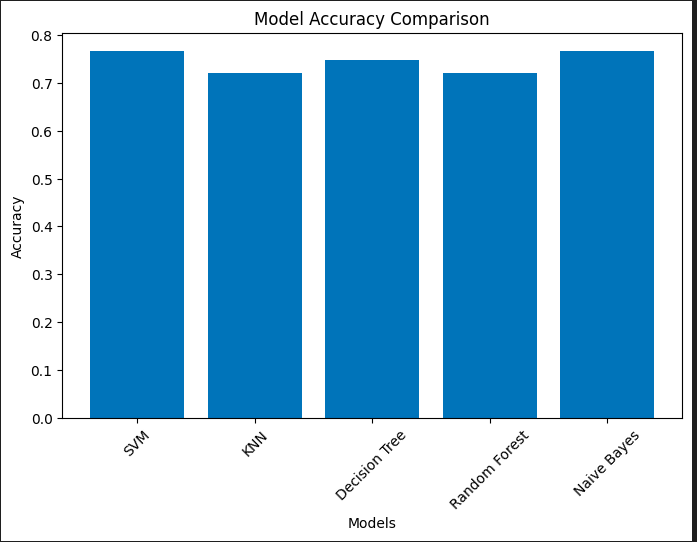
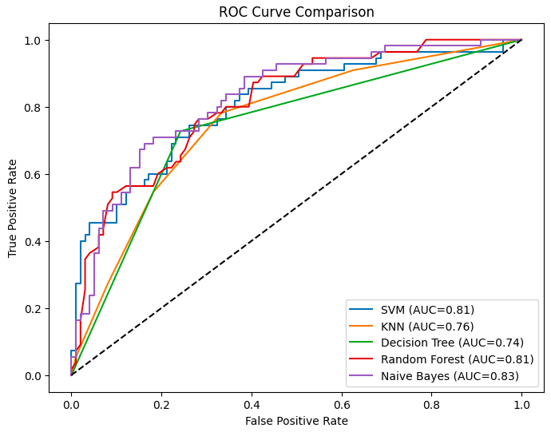
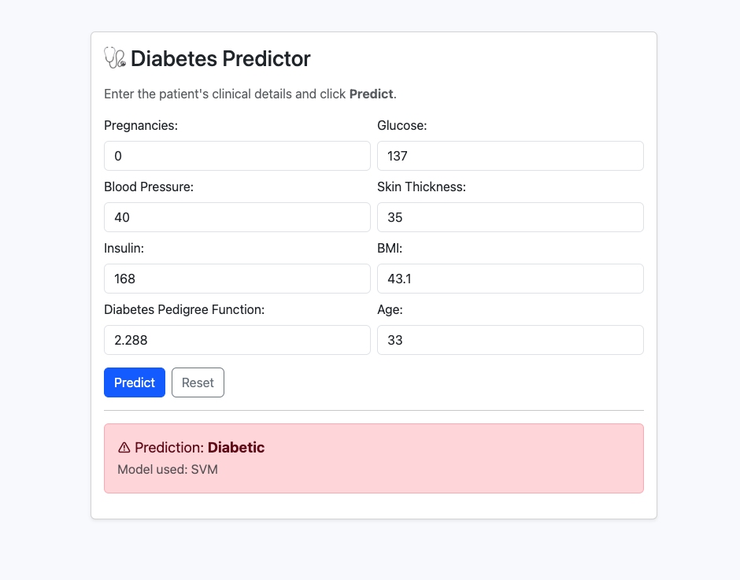

# 🩺 Diabetes Prediction System

A machine learning–based web application that predicts whether a patient is diabetic based on clinical parameters.  
The system evaluates multiple machine learning models and **automatically selects the best-performing model** for prediction.

---

## 🚀 Features
- Trained and evaluated multiple ML models
- Automated selection of best model based on accuracy
- Flask-based backend API
- Clean and responsive Bootstrap frontend
- Real-time diabetes prediction
- End-to-end ML pipeline (training → evaluation → deployment)

---

## 🧠 Machine Learning Models Used
- Support Vector Machine (SVM)
- K-Nearest Neighbors (KNN)
- Decision Tree
- Random Forest
- Naive Bayes

The model with the **highest accuracy** is selected automatically at runtime for inference.

---

## 📊 Model Performance Comparison

The bar chart below shows the accuracy comparison of all trained models:

---

## 🖥️ User Interface

### Prediction Result

---

## ⚙️ Tech Stack
- **Language:** Python  
- **Backend:** Flask  
- **Frontend:** HTML, Bootstrap, JavaScript  
- **Machine Learning:** Scikit-learn  
- **Data Handling:** NumPy, Pandas  

---

## 🏗️ Project Structure
